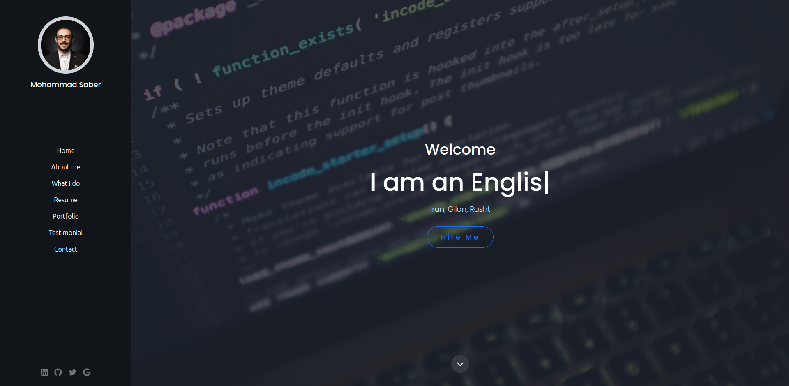

# React Portfolio

A simple portfolio to showcasing the skills, projects, and experiences. This project combines the power of React for the front end and WordPress technology for the backend, providing a dynamic and engaging experience.

## Table of Contents
- [Introduction](#introduction)
- [Features](#features)
- [Project Structure](#project-structure)
- [Installation](#installation)
- [Usage](#usage)
- [Contributing](#contributing)
- [License](#license)

## Introduction

This open-source portfolio project demonstrates the fusion of React and WordPress technologies, offering a user-friendly platform to showcase professional achievements.

scr

## Features

- **Intuitive Design:** A clean and simple design for easy navigation.
- **React Frontend:** Utilizes the power of React for a dynamic user interface.
- **WordPress Backend:** Managed by Docker Compose, integrating a WordPress installation for efficient content management.
- **Custom Theme:** A tailor-made theme to enhance the backend experience.

## Project Structure
The project is organized into two main directories:

- **`client`:** Contains the React front end.
- **`server`:** Managed by Docker Compose, it includes a WordPress installation inside the `public` directory and a custom theme to manage the backend.

## Installation

To run this project locally, follow these steps:

1. Clone the repository: `git clone https://github.com/Mhmdsbr/your-portfolio.git`
2. Navigate to the `client` directory: `cd your-portfolio/client`
3. Install dependencies: `npm install`
4. Start the development server: `npm start` (for development) or `npm run build` (for production)
5. Open your browser and go to `http://localhost:3000`

## Usage

Navigate and interact with the portfolio seamlessly, experiencing the blend of React and WordPress technologies.

### Admin account setup

Apply the database schema before opening the admin area with `npm run db:push`
using the database environment you intend to use. Databases created before the
section-settings consolidation (with `hero_section`, `about_section`,
`experience_section` and `contact_section` tables) must instead run
`npm run db:upgrade` once; it migrates the existing data in a single
transaction. Back up the database first. The first visit to
`/admin/login` redirects to the one-time `/admin/signup` page while no admin
accounts exist. Configure SMTP on the server before signing up by setting
`SMTP_HOST`, `SMTP_PORT`, `SMTP_USERNAME`, and `SMTP_PASSWORD` in the local
`.env` file or your deployment secret manager. These values are server-only and
are not editable through the admin panel or returned by public APIs. Existing
installations should move their SMTP values from General Settings into the
server environment before applying the schema migration, which removes the
database columns. Rotate credentials that were stored in the database.
Initial and additional admin accounts
are created only after confirming a six-digit code sent to their email address.
Codes expire after 10 minutes, allow five attempts, and can be requested once
per minute. Once the first account is created, public sign-up closes; signed-in
admins can add, deactivate, reactivate, or reset other admin accounts in
**Profile Settings**. Deactivated accounts and their profile data are retained.
Passwords are stored as scrypt hashes, and sessions use opaque HTTP-only cookies
backed by the database.

## Contributing

If you'd like to contribute to this project, please follow these steps:

1. Fork the repository
2. Create a new branch: `git checkout -b feature-name`
3. Make your changes and commit them: `git commit -m 'Add some feature'`
4. Push to the branch: `git push origin feature-name`
5. Open a pull request

## License

This project is licensed under the MIT.

Feel free to customize this template further based on your preferences and any additional details you'd like to include.

## Changelog

See [CHANGELOG.md](./CHANGELOG.md) for version history and release notes.
