# Database architecture

How the PostgreSQL database is structured, how data gets in and out, and which
layer guards what. The column-level reference is in
[database-schema.md](./database-schema.md); this document shows the big picture.

Diagrams use [Mermaid](https://mermaid.js.org/) and render on GitHub and in VS Code.

## 1. System overview

Every read and write goes through Drizzle (`src/lib/db`). Admin changes are
Next.js server actions guarded by `requireAuth()`. The public site reads a single
JSON payload from `/api/all`.

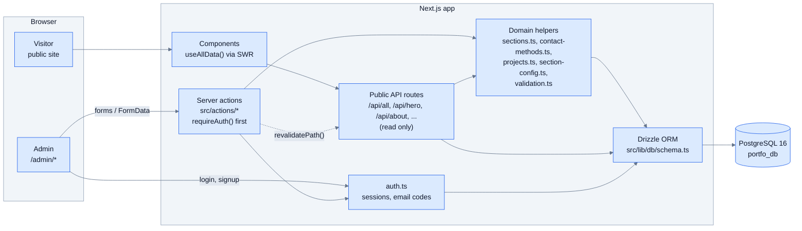

## 2. Entity relationships

Tables are grouped by purpose. Only foreign keys are drawn; `page_sections`
carries the per-section settings in its `config` column instead of separate
tables.

### Page layout and contact methods

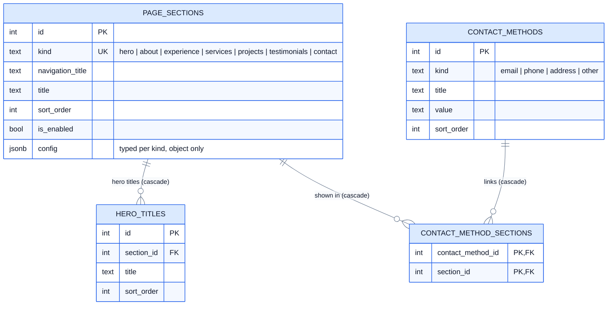

### Projects

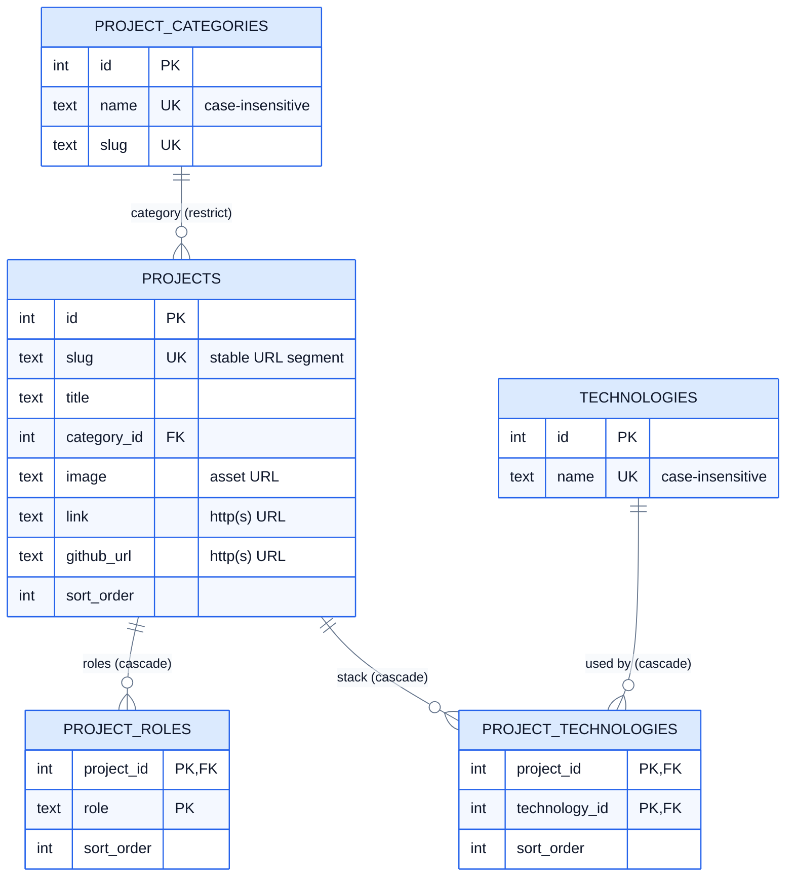

Standalone content tables have no foreign keys and are attached to a page
section only by the application (see section 3):

| Table | Holds | Notable constraints |
| --- | --- | --- |
| `profile` | name, job title, biography | singleton (`id = 1`) |
| `profile_facts` | number + title pairs for the About section | |
| `experiences` | jobs | years 1900-2100, end year not before start; `to_year` null = present |
| `skills` | skill + level | level 0-100 |
| `services` | title, description, icon | icon in `SERVICE_ICONS` |
| `testimonials` | quotes | rating 1-5, image URL pattern |
| `social_links` | platform + URL | unique platform in `SOCIAL_PLATFORMS`, URL pattern |
| `site_config` | footer text, recaptcha key | singleton (`id = 1`) |

### Admin and authentication

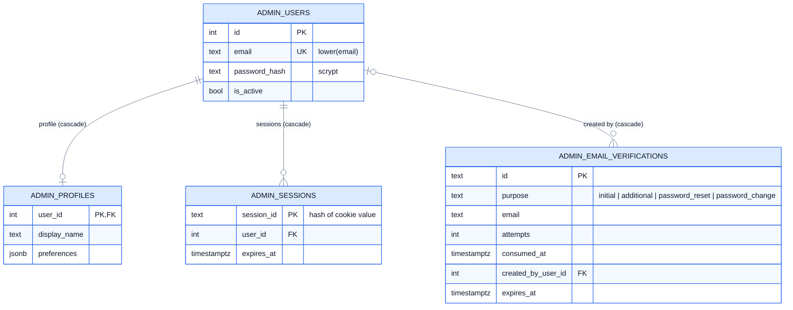

## 3. Which tables feed which section

`page_sections` is the hub: one row per `kind` that holds the section's title,
nav label, order, visibility, and its own `config`. The API assembles each
section's payload from those rows plus the content tables.

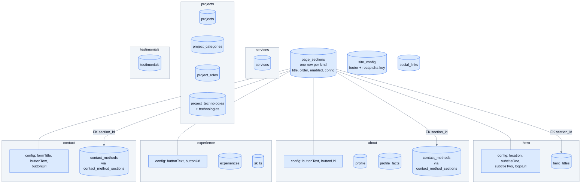

`site_config` feeds the `footer` and `config` parts of the payload. `social_links`
is stored but not currently returned by the API.

## 4. Read path: from tables to the page

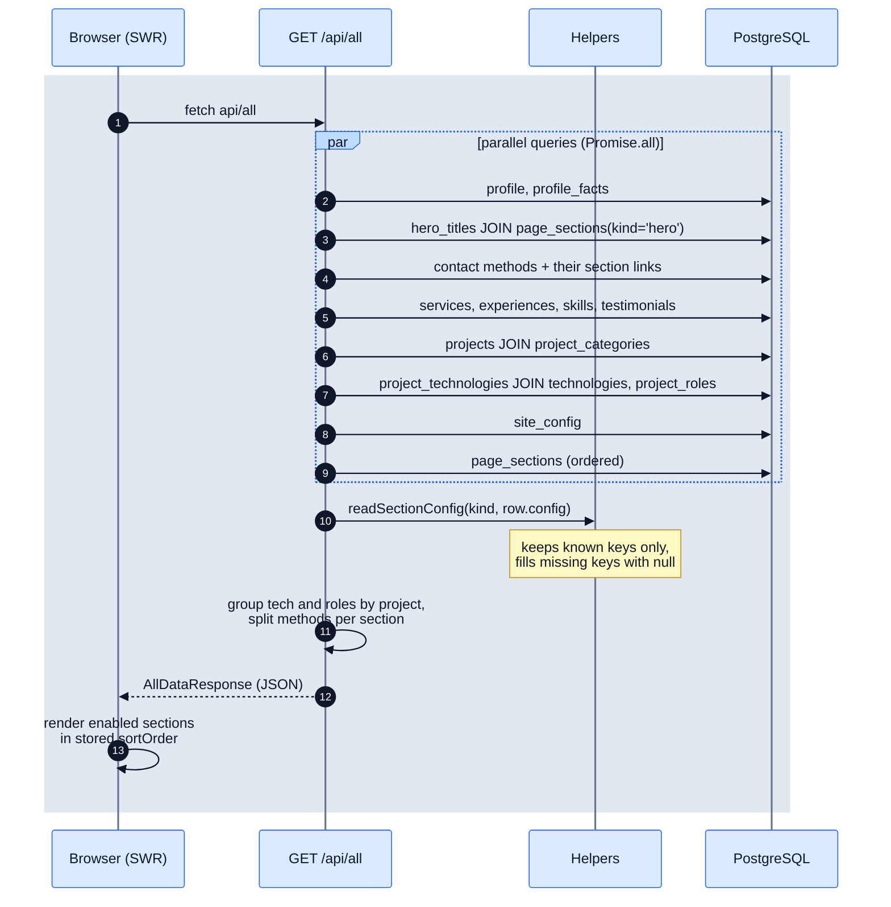

Section order and visibility come from `page_sections`, so `app/page.tsx` renders
the components in the order stored in the database and skips disabled kinds.

## 5. Write path: admin edits

Each admin form calls a server action. The action authenticates, validates and
normalizes input, writes inside a transaction when several tables are involved,
then revalidates the cached paths.

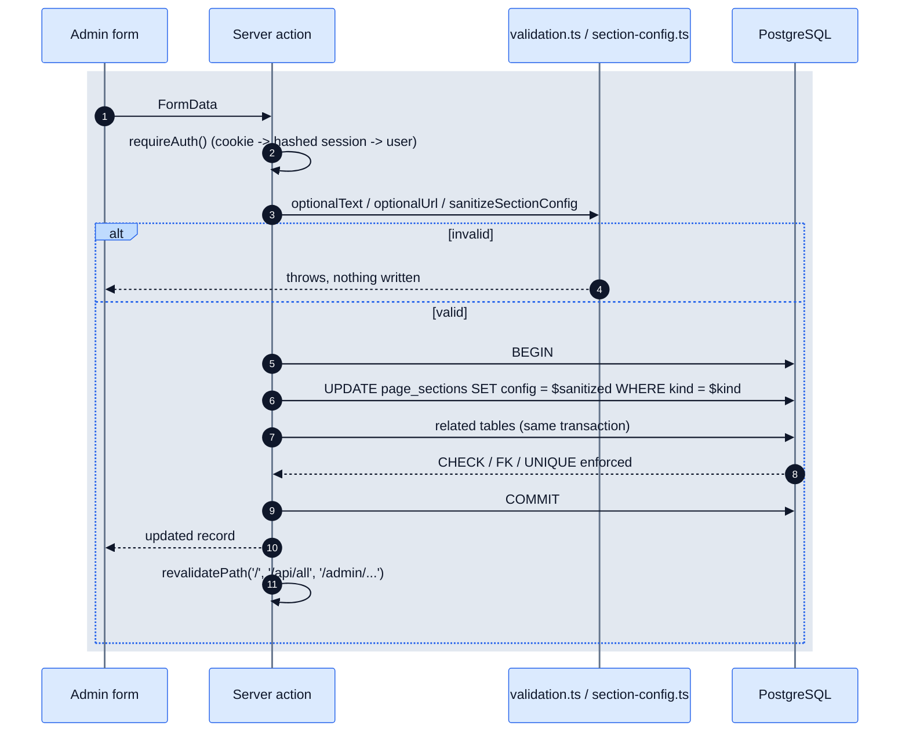

### Actions and what they touch

| Action module | Tables written | Notes |
| --- | --- | --- |
| `hero.ts` | `page_sections.config` (hero), `hero_titles` | titles are replaced as a list |
| `about.ts` | `page_sections.config` (about), `profile`, `profile_facts` | profile is a singleton row |
| `experience.ts` | `page_sections.config` (experience), `experiences`, `skills` | year range validated |
| `contact.ts` | `page_sections.config` (contact), `contact_methods`, `contact_method_sections` | method + section links in one transaction |
| `services.ts` | `services` | icon checked against `SERVICE_ICONS` |
| `testimonials.ts` | `testimonials` | rating 1-5, image URL validated |
| `projects.ts` | `projects`, `project_categories`, `project_roles`, `technologies`, `project_technologies` | see section 7 |
| `header.ts` | `page_sections` (title, nav title, order, enabled) | used by every Section settings card and by Page layout; at least one section must stay enabled |
| `footer.ts`, `config.ts` | `site_config` | singleton row |
| `profile.ts`, `auth.ts` | `admin_*` tables | see section 8 |

## 5a. Admin panel layout

The admin is organised the same way as the data: every section page has the same
first card, **Section settings**, which edits that section's `page_sections` row
(navigation label, title, visibility). Below it come the section's own `config`
form and its content records. **Page layout** only changes order and visibility.

| Admin page | Section settings (`page_sections`) | Config form (`config`) | Content records |
| --- | --- | --- | --- |
| `/admin/hero` | `hero` | location, subtitles, logo | `hero_titles` |
| `/admin/about` | `about` | button | `profile`, `profile_facts`, **contact methods** |
| `/admin/experience` | `experience` | resume button | `experiences`, `skills` |
| `/admin/services` | `services` | none | `services` |
| `/admin/projects` | `projects` | none | `projects`, `project_categories` |
| `/admin/testimonials` | `testimonials` | none | `testimonials` |
| `/admin/contact` | `contact` | form title, button | **contact methods** |
| `/admin/header` | all kinds | none | order and visibility only |

Contact methods appear on both the About and Contact pages because they are shared
records; the checkboxes on each method decide which sections show it.

The section actions (`getHero`, `getAbout`, `getContact`, `getExperience`,
`getServices`, `getTestimonials`, `getProjectsOverview`) return the same shape,
`{ section, config?, ...content }`, where `section` is the `page_sections` metadata.

Naming is the same in the database, the admin and the API: `experiences` are the
jobs, `skills` are the skills, and the API key and route are `experience`
(`/api/experience`, `data.experience.experiences`, `data.experience.skills`).

Project categories are chosen from the existing rows (`CategorySelect`); typing a
new name creates a category on save.

## 6. Section settings (`page_sections.config`)

Settings that used to live in four tables are now one JSONB object per section.
The TypeScript type per kind is the contract; the database only guarantees that
`config` is a JSON object.

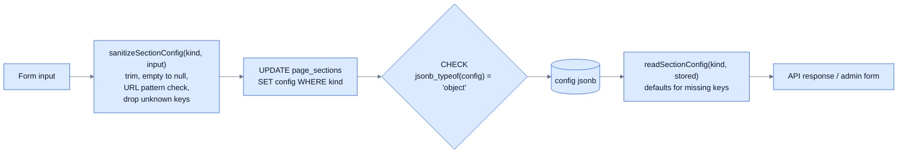

| Kind | Config keys |
| --- | --- |
| `hero` | `location`, `subtitleOne`, `subtitleTwo`, `logoUrl` |
| `about` | `buttonText`, `buttonUrl` |
| `experience` | `buttonText`, `buttonUrl` |
| `contact` | `formTitle`, `buttonText`, `buttonUrl` |
| `services`, `projects`, `testimonials` | none |

Code finds a section by `kind` through the typed constants in
`src/lib/db/constants.ts` (`getSection(kind)`, `updateSectionConfig(kind, ...)`,
`requireSectionId(kind)`), so queries never contain free-form section names.

## 7. Projects, categories, slugs, technologies

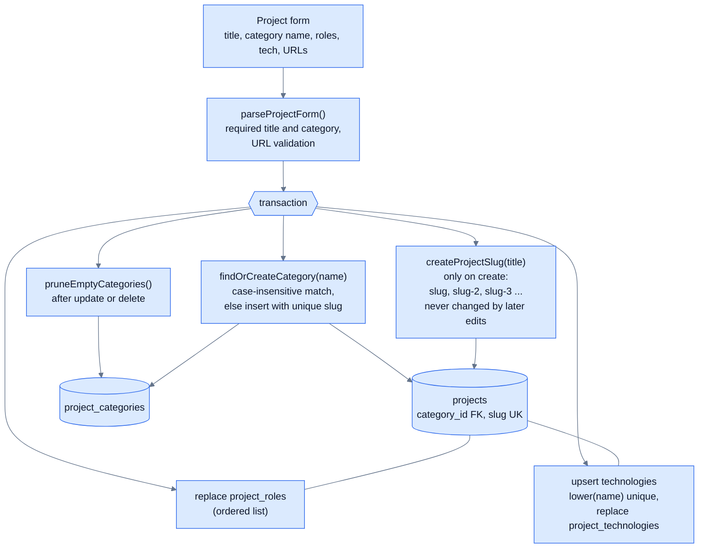

Public URLs:

- `/projects/<projects.slug>` is the project page.
- `/projects/category/<project_categories.slug>` lists a category.

Both are looked up directly by their unique slug instead of re-deriving it from
the title.

## 8. Contact methods across sections

A contact method is one record that can be displayed by the About section, the
Contact section, or both. Display order is global (`contact_methods.sort_order`).

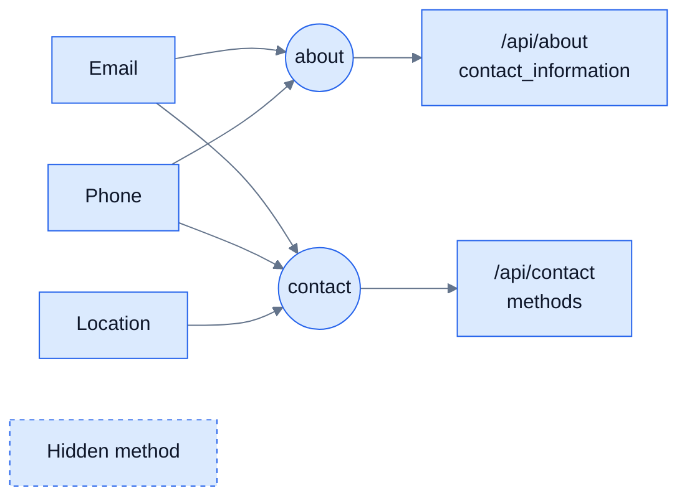

Stored as rows in `contact_method_sections (contact_method_id, section_id)`.
A method with no rows is hidden everywhere. Deleting a method or a section removes
its links (`ON DELETE CASCADE`).

## 9. Admin authentication data

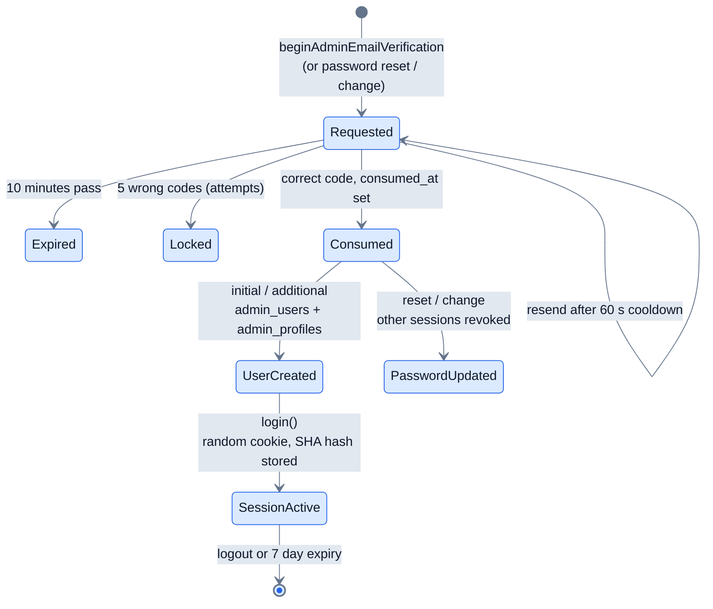

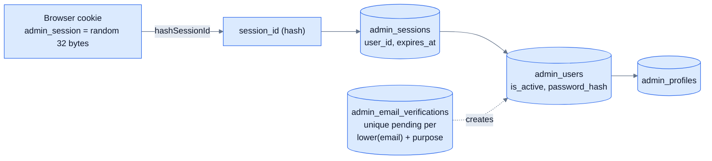

Only a hash of the cookie value is stored, so a database leak does not expose
usable sessions. Indexes on `admin_sessions.expires_at` and
`admin_email_verifications.expires_at` support expiry cleanup queries.

## 10. Where each rule is enforced

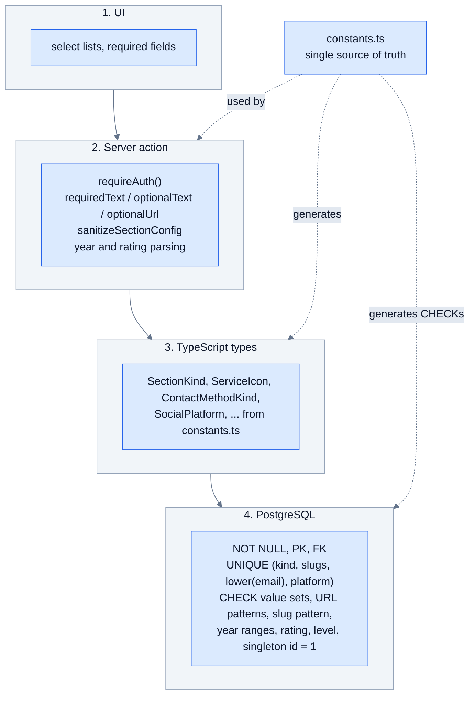

The value sets and URL/slug regex patterns are defined once in
`src/lib/db/constants.ts`, and are used both to build the `CHECK` constraints and to
type and validate application code, so the layers cannot disagree.

## 11. Schema lifecycle and operations

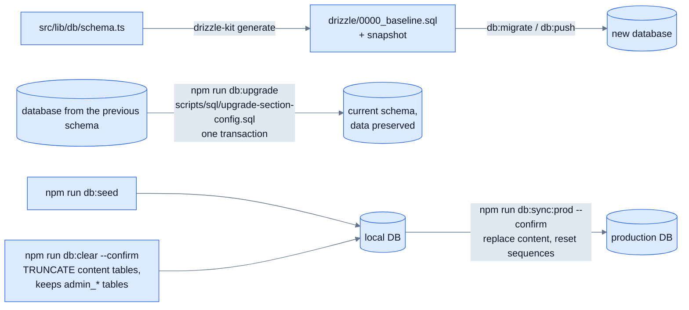

| Command | Effect |
| --- | --- |
| `npm run db:push` | create or sync the schema from `schema.ts` (new databases) |
| `npm run db:upgrade` | migrate a pre-consolidation database in place; refuses to run twice |
| `npm run db:seed` | insert sample portfolio content, sections with config and links |
| `npm run db:clear` | truncate content tables and reset identity sequences; admin accounts are kept |
| `npm run db:sync:prod` | copy local content tables to production in one transaction; admin tables are never copied |

## 12. Cascade and delete behaviour

| Deleting | Also removes | Blocked when |
| --- | --- | --- |
| a `page_sections` row | its `hero_titles`, `contact_method_sections` | |
| a `contact_methods` row | its `contact_method_sections` | |
| a `projects` row | its `project_roles`, `project_technologies` | |
| a `technologies` row | its `project_technologies` links | |
| a `project_categories` row | | any project still uses it (`RESTRICT`) |
| an `admin_users` row | profile, sessions, verifications it created | |
