# Database schema

For data flow, write paths, and enforcement layers, see
[database-architecture.md](./database-architecture.md).

This diagram describes the Drizzle schema in `src/lib/db/schema.ts`. Solid
relations are enforced foreign keys. Value sets (section kinds, icons, contact
kinds, social platforms, verification purposes) and URL/slug patterns live in
`src/lib/db/constants.ts` and are enforced with `CHECK` constraints, so the
TypeScript types and the database cannot drift apart.

```mermaid
%%{init: {'theme':'base','themeVariables':{'primaryColor':'#dbeafe','primaryTextColor':'#0f172a','primaryBorderColor':'#2563eb','lineColor':'#64748b','textColor':'#0f172a','mainBkg':'#dbeafe','nodeBorder':'#2563eb','edgeLabelBackground':'#e2e8f0','attributeBackgroundColorOdd':'#f8fafc','attributeBackgroundColorEven':'#e2e8f0','tertiaryColor':'#f1f5f9'}}}%%
erDiagram
    PAGE_SECTIONS {
        int id PK
        text kind UK "hero, about, experience, services, projects, testimonials, contact"
        text navigation_title
        text title
        int sort_order
        boolean is_enabled
        jsonb config "settings for this kind"
    }

    HERO_TITLES {
        int id PK
        int section_id FK
        text title
        int sort_order
    }

    CONTACT_METHODS {
        int id PK
        text kind "email, phone, address, other"
        text title
        text value
        int sort_order
    }

    CONTACT_METHOD_SECTIONS {
        int contact_method_id PK, FK
        int section_id PK, FK
    }

    PROFILE {
        int id PK "always 1"
        text name
        text job_title
        text biography
    }

    PROFILE_FACTS {
        int id PK
        int number
        text title
        int sort_order
    }

    EXPERIENCES {
        int id PK
        int from_year
        int to_year
        text job_title
        text company
        text description
        int sort_order
    }

    SKILLS {
        int id PK
        text skill
        int level "0 to 100"
        int sort_order
    }

    SERVICES {
        int id PK
        text title
        text description
        text icon
        int sort_order
    }

    PROJECT_CATEGORIES {
        int id PK
        text name UK "case-insensitive"
        text slug UK
    }

    PROJECTS {
        int id PK
        text slug UK
        text title
        int category_id FK
        text description
        text image
        text link
        text github_url
        int sort_order
    }

    PROJECT_ROLES {
        int project_id PK, FK
        text role PK
        int sort_order
    }

    TECHNOLOGIES {
        int id PK
        text name UK "case-insensitive"
    }

    PROJECT_TECHNOLOGIES {
        int project_id PK, FK
        int technology_id PK, FK
        int sort_order
    }

    TESTIMONIALS {
        int id PK
        text image_url
        text title
        text subtitle
        int rating "1 to 5"
        text body
        int sort_order
    }

    SOCIAL_LINKS {
        int id PK
        text platform UK
        text url
        int sort_order
    }

    SITE_CONFIG {
        int id PK "always 1"
        text company_name
        text privacy_policy
        text terms_of_service
        text disclaimer
        text copyright_text
        text recaptcha_site_key
    }

    ADMIN_USERS {
        int id PK
        text email UK "case-insensitive"
        text password_hash
        boolean is_active
    }

    ADMIN_PROFILES {
        int user_id PK, FK
        text display_name
        text bio
        jsonb preferences
    }

    ADMIN_SESSIONS {
        text session_id PK
        int user_id FK
        timestamp expires_at
    }

    ADMIN_EMAIL_VERIFICATIONS {
        text id PK
        text purpose
        text email
        text display_name
        text password_hash
        int created_by_user_id FK
        timestamp expires_at
        timestamp consumed_at
    }

    PAGE_SECTIONS ||--o{ HERO_TITLES : "section_id"
    PAGE_SECTIONS ||--o{ CONTACT_METHOD_SECTIONS : "section_id"
    CONTACT_METHODS ||--o{ CONTACT_METHOD_SECTIONS : "contact_method_id"

    PROJECT_CATEGORIES ||--o{ PROJECTS : "category_id"
    PROJECTS ||--o{ PROJECT_ROLES : "project_id"
    PROJECTS ||--o{ PROJECT_TECHNOLOGIES : "project_id"
    TECHNOLOGIES ||--o{ PROJECT_TECHNOLOGIES : "technology_id"

    ADMIN_USERS ||--o| ADMIN_PROFILES : "user_id"
    ADMIN_USERS ||--o{ ADMIN_SESSIONS : "user_id"
    ADMIN_USERS o|--o{ ADMIN_EMAIL_VERIFICATIONS : "created_by_user_id"
```

## Conventions

- Content tables have `created_at` and `updated_at`, defined once by the
  `timestamps()` helper in `schema.ts`. Join tables have neither;
  `technologies`, `admin_sessions` and `admin_email_verifications` only have
  `created_at`.
- Ordered lists use `sort_order`; queries break ties with `id`
  (`src/lib/db/order.ts`).
- Empty form values are stored as `NULL`, never as empty strings.
- URL columns are checked against `WEB_URL_PATTERN` (absolute http(s)),
  `ASSET_URL_PATTERN` (http(s) or site path) or `LINK_URL_PATTERN` (also anchors,
  `mailto:` and `tel:`).

## Page sections

`page_sections` has exactly one row per section `kind`. The code looks sections
up by kind through the typed constants in `src/lib/db/constants.ts`; there are
no section names in the queries themselves.

Section-specific settings are stored in `page_sections.config` (jsonb). Their
shape is defined per kind in `src/lib/db/section-config.ts`, which also
validates input on write and fills defaults on read:

| Kind | `config` keys |
| --- | --- |
| `hero` | `location`, `subtitleOne`, `subtitleTwo`, `logoUrl` |
| `about`, `experience` | none |
| `contact` | `formTitle`, `buttonText`, `buttonUrl` |
| `services`, `projects`, `testimonials` | none |

`hero_titles` belong to the `hero` section through `section_id`.

## Content shown by each section

| Section | Data returned with it |
| --- | --- |
| `hero` | `config`, `hero_titles` |
| `about` | `profile`, `profile_facts`, contact methods linked to it |
| `experience` | `experiences`, `skills` |
| `services` | `services` |
| `projects` | `projects`, `project_categories`, `project_roles`, `technologies` |
| `testimonials` | `testimonials` |
| `contact` | `config`, contact methods linked to it |

Contact methods are shared records. `contact_method_sections` says which
sections (`about`, `contact`, or both) display each method; a method linked to
neither is hidden.

## Projects

- `projects.slug` is the stable public URL segment. It is generated from the
  title on creation (with `-2`, `-3`, ... on collisions) and is not changed by
  later title edits.
- Categories are rows in `project_categories` (unique case-insensitive name and
  unique slug). The admin form still takes a category name; it reuses the
  matching category or creates one, and categories without projects are
  removed.
- Deleting a category that still has projects is rejected (`ON DELETE RESTRICT`).

## Site-level tables

`social_links` (unique `platform`, restricted to the platforms in
`SOCIAL_PLATFORMS`) and the singleton `site_config` (footer text and runtime
configuration) are independent of the section tables.

## Migrations

`drizzle/0000_baseline.sql` creates the whole schema for new databases. For
databases created from the previous schema, `npm run db:upgrade` runs
`scripts/sql/upgrade-section-config.sql`, which converts the data in place and
fails without changes if anything does not fit the new constraints.
